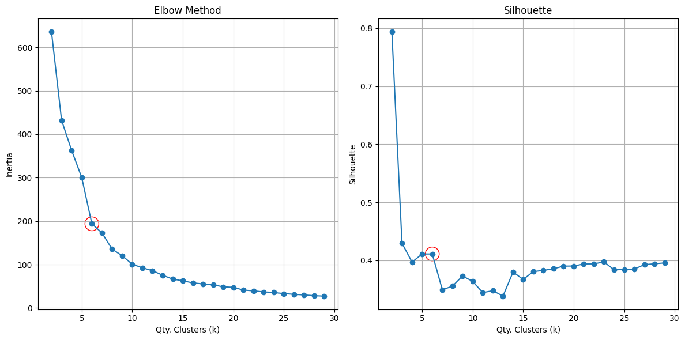
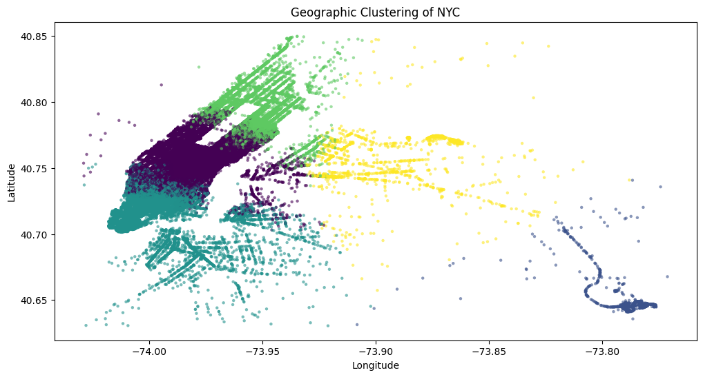

# New York City Taxi Trip Prediction

This project aims to create predictive models to estimate the daily number of taxi trips in New York City. Using the public dataset available on [kaggle](https://www.kaggle.com/c/nyc-taxi-trip-duration), various machine learning methods and time series models will be explored to capture patterns and make demand forecasts.

# Credits
This project is based on [justin-hj-kim's NYC Taxi Trip Data Science Project](https://github.com/justin-hj-kim/NYCtaxi_data_science). I will use, and mention, parts of his code to accelerate development and analysis.

# Replication
To replicate the environment, ensure you are using Python 3.12 and run the code above.

``` bash
. install.sh
```

# Dataset
To download the dataset, you need to configure your Kaggle API key in the root directory. Follow the [referenced guide](https://www.kaggle.com/discussions/general/156610) to set it up.

After that run the code, and then unzip the train/test files.

```bash
kaggle competitions download -c nyc-taxi-trip-duration -p data/raw
```

# 0.Exogenous Data Capture
Getting exogenous data that can help prediction.  

Three datasets were used to get exogenous data:  
- [Weather Data from NYC Central Park](https://www.weather.gov/wrh/Climate?wfo=okx)  
- [NYC Street Centerline](https://data.cityofnewyork.us/City-Government/NYC-Street-Centerline-CSCL-/exjm-f27b)  
- [NYC Address Point](https://data.cityofnewyork.us/City-Government/NYC-Address-Points/g6pj-hd8k) - Not used

To treat the data access the code bellow.  
[00-Exogenous-Data-Capture.ipynb](notebooks/00-Exogenous-Data-Capture.ipynb)

# 1.Data Basic Process
Cleaning data, removing data points out of NYC bounds [long - (-74.03, -73.75), lat - (40.63, 40.85)], merging travels with weather information and data point knowledge base, fixing features to the right type.

[01-Data-Basic-Process.ipynb](notebooks/01-Data-Basic-Process.ipynb)

```bash
python src/data/basic_process.py --config_file=features --dataset_name=full
```

# 2.Split Data
Split train, test and validation datasets to avoid leak on feature engineering. Using [20160101, 20160601) for training, with 10% of out-of-sample for validation, and [20160601, 20160701) for test.

```bash
python src/data/split_train_test.py --dataset_name=full --ymd_train=20160101 --ymd_test=20160601
```

# 3.Feature Engineering
Used Latitude and Longitude of pickup and drop to cluster locations with Kmeans. After testing different values for K, i've choosed k=6 mainly because of the silhouette coefficient.  

An then we have 6 clusters distributed along NYC.  


Other features were created using pickupdate.  
To execute this part, run the code bellow.  

```bash
python src/features/create_features.py --dataset_preffix=full
```

# 4.Encoding
Categorical encoding, applied  to features with more than 15 categories.  

To create the encoders run this script:  
```bash
python src/features/create_encoders.py --dataset_preffix=full
```

And to encode dataset and save a checkpoint, run this:  
```bash
python src/features/create_encoded_features.py --dataset_preffix=full
```

# 5.Condensing Features
Condense analytical features to daily features.  


# 6.Normalization
Transform features for different scale (log, sqrt, exp).  

# 6.Feature Selection (?)
Reduce dimensionality and variance


# 7.Tunning (?)
Tune params/hyperparams/architectures

# 8.Train Model (?)
ARIMA  
SARIMAX - Seasonal  
Boosting - XGBoost/LightGBM  
Logistic Regression  
Linear Regression  
Basic MLP  
LSTM  

# 9.Register Experiment (mlflow?)
Use a framework to register experiments (maybe a folder structure)

# 10.Results
Compare results between techniques


## Project Organization

<a target="_blank" href="https://cookiecutter-data-science.drivendata.org/">
    
</a>


```
├── LICENSE            <- Open-source license if one is chosen
├── Makefile           <- Makefile with convenience commands like `make data` or `make train`
├── README.md          <- The top-level README for developers using this project.
├── data
│   ├── external       <- Data from third party sources.
│   ├── interim        <- Intermediate data that has been transformed.
│   ├── processed      <- The final, canonical data sets for modeling.
│   └── raw            <- The original, immutable data dump.
│
├── docs               <- A default mkdocs project; see www.mkdocs.org for details
│
├── models             <- Trained and serialized models, model predictions, or model summaries
│
├── notebooks          <- Jupyter notebooks. Naming convention is a number (for ordering),
│                         the creator's initials, and a short `-` delimited description, e.g.
│                         `1.0-jqp-initial-data-exploration`.
│
├── pyproject.toml     <- Project configuration file with package metadata for 
│                         src and configuration for tools like black
│
├── references         <- Data dictionaries, manuals, and all other explanatory materials.
│
├── reports            <- Generated analysis as HTML, PDF, LaTeX, etc.
│   └── figures        <- Generated graphics and figures to be used in reporting
│
├── requirements.txt   <- The requirements file for reproducing the analysis environment, e.g.
│                         generated with `pip freeze > requirements.txt`
│
├── setup.cfg          <- Configuration file for flake8
│
└── src   <- Source code for use in this project.
    │
    ├── __init__.py             <- Makes src a Python module
    │
    ├── config.py               <- Store useful variables and configuration
    │
    ├── dataset.py              <- Scripts to download or generate data
    │
    ├── features.py             <- Code to create features for modeling
    │
    ├── modeling                
    │   ├── __init__.py 
    │   ├── predict.py          <- Code to run model inference with trained models          
    │   └── train.py            <- Code to train models
    │
    └── plots.py                <- Code to create visualizations
```

--------

